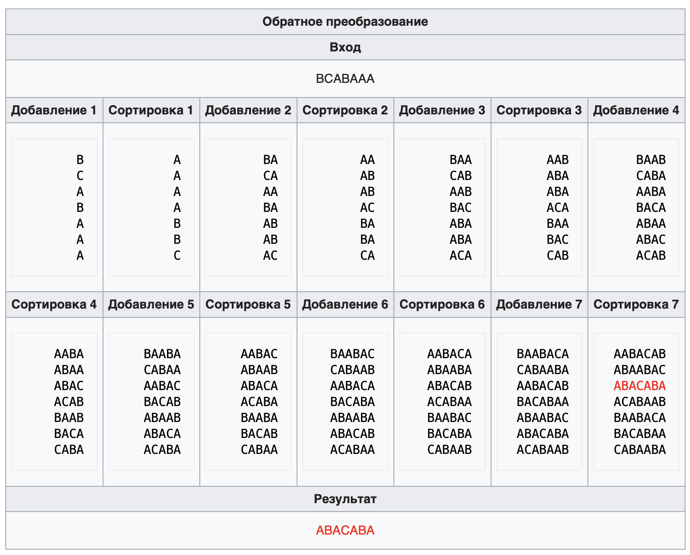

# Теоретическая часть 

## Условие задачи

**Преобразование Барроуза — Уилера** (англ. *Burrows-Wheeler transform*)
— алгоритм, используемый для предварительной обработки данных перед
сжатием, разработанный для улучшения эффективности последующего кодирования.
Преобразование Барроуза — Уилера меняет порядок символов во входной
строке таким образом, что повторяющиеся подстроки образуют на выходе
идущие подряд последовательности одинаковых символов.

BWT не сжимает данные, но преобразует блок данных в формат, исключительно подходящий для компрессии.

Прежде всего, следует отметить одну из его особенностей. BWT оперирует сразу целым блоком данных. 
То есть, ему заранее известны сразу все элементы входного потока или, по крайней мере, достаточно большого блока. 
Это делает затруднительным использование алгоритма в тех областях применения, где требуется сжатие данных “на лету”, 
символ за символом.

Преобразование Барроуза — Уилера используется вместе со следующими методами:

- кодирование длин повторов (RLE);
- метод перемещения стопки книг (MTF);
- кодирование расстояний (DC);
- метод Хаффмана;
- арифметическое кодирование.

Следует отметить еще одно преобразование, основанное на сортировке блока данных – преобразование Шиндлера (ST). 
ST является не разновидностью преобразования Барроуза-Уилера, а скорее его обобщением.  

BWT и ST используются в следующих архиваторах (`компрессор` версия): `Imp` 1.12 (метод 2), `X1` 0.95 (метод 7), `SZip` 1.12, `BWC` 0.99, `BZip` 0.21, 
`BZip2` 1.0.1, `Bred`, `Bred2`, `Bred3`, `BA` 1.01br5, `ZZip` 0.36c, `DC` 0.99, `ERI` 4.17, `SBC` 0.850b, `YBS` 0.03e.

## Подходы к решению задачи

### Формальная постановка задачи

Реализовать утилиту для сжатия текстовых данных с использованием преобразования Барроуза — Уилера с коэффициентом сжатия   
`k = size_of_input_file / size_of_compressed_file`  
порядка 1,5.

### 1. BWT (Burrows-Wheeler Transform)

#### Прямой алгоритм преобразования Барроуза — Уилера
**Вход:** строка для кодирования  
**Выход:** закодированная строка, ее номер в таблице циклических сдвигов

1. Составляется таблица всех циклических сдвигов входной строки.
2. Производится лексикографическая (в алфавитном порядке) сортировка строк таблицы.
3. В качестве выходной строки выбирается последний столбец таблицы
   преобразования и номер строки, совпадающей с исходной.

**Пример**  
Нужно закодировать строку `'ABACABA'`
```
|   Input    | Cyclic shifts | Sort strings |   Output   |
|------------|---------------|--------------|------------|
|            |    ABACABA <- |   AABACAB    |            |
|            |    BACABAA    |   ABAABAC    |            |
|            |    ACABAAB    |   ABACABA <- |            |
|  ABACABA   |    CABAABA    |   ACABAAB    | BCABAAA, 3 |
|            |    ABAABAC    |   BAABACA    |            |
|            |    BAABACA    |   BACABAA    |            |
|            |    AABACAB    |   CABAABA    |            |
```
Результат можно записать так: `BWT('ABACABA')=('BCABAAA', 3)`, где 3 — номер исходной строки в отсортированной матрице. Он нужен для обратного преобразования.

**Достоинства:** работает довольно быстро — временная сложность данного 
алгоритма `O(NlogN)` (из-за сортировки), пространственная `O(N)`  
**Недостатки:** нет

#### Наивный обратный алгоритм преобразования Барроуза — Уилера
**Вход:** закодированная строка, ее номер `k` в таблице циклических сдвигов  
**Выход:** раскодированная строка
1. Для получения таблицы циклических сдвигов создаются `n` строк
   (`n` - количество символов во входной строке). В `i`-ую строку
   записывается `i`-ый символ входной строки. Полученные строки сортируются по
   возрастанию в лексикографическом порядке.
2. К `i`-ой строке слева (в качестве первого символа строки) приписывается `i`-ый символ
   входной строки, после чего строки снова сортируются. Операция выполняется до тех пор,
   пока в каждой из строк таблицы не окажется `n` символов.
3. В полученной таблице выбираем строку с номером `k`. Это и есть искомая строка.

**Пример**


**Достоинства:** работает  
**Недостатки:** очень долго и дорого — временная сложность данного алгоритма `O(N^3*logN)`, пространственная `O(N^2)`

#### Улучшенный обратный алгоритм преобразования Барроуза — Уилера

**Вход:** закодированная строка `last`, ее номер `k` в таблице циклических сдвигов  
**Выход:** раскодированная строка

Наивный алгоритм можно оптимизировать. Заметим, что при каждом проявлении неизвестного столбца выполнялись одни и 
те же действия. К предыдущему приписывался новый столбец и имеющиеся данные сортировались. На каждом шаге к строке, 
которая находилась на i-ом месте, приписывался в начало i-ый элемент столбца входных данных. Пусть изначально известно,
каким по порядку является приписанный в начало символ (то есть каким по порядку в столбце). Из предыдущего шага 
известно, какое место занимала строка без этого первого символа (i-ое). Тогда несложно заметить, что при выполнении 
такой операции строка с номером i всегда будет перемещаться на позицию с номером j.

1. Для получения первого столбца матрицы циклических сдвигов символы
   закодированной строки сортируются в лексикографическом порядке. Получается объект `first`.
2. Формируется взаимно однозначное соответствие между элементами объекта `first` и элементами объекта `last`
3. Формируется выходная строка

**Пример**  
Нужно декодировать строку `'рдакраааабб'`, `k = 2`.  
```
| Index | Sorted  |      | Index | Symbol | № in sorted |
|       | symbols |      |       |        |   symbols   |
|-------|---------|      |-------|--------|-------------|
|   0   |    a    |      |   0   |   p    |     9       |
|   1   |    a    |      |   1   |   д    |     7       |
|   2   |    a    |      |   2 ->|   а    | ->  0       |
|   3   |    a    |      |   3   |   к    |     8       |
|   4   |    a    |      |   4   |   р    |     10      |
|   5   |    б    |      |   5   |   а    |     1       |
|   6   |    б    |      |   6   |   а    |     2       |
|   7   |    д    |      |   7   |   а    |     3       |
|   8   |    к    |      |   8   |   а    |     4       |
|   9   |    р    |      |   9   |   б    |     5       |
|   10  |    р    |      |   10  |   б    |     6       |
```  
Каждому символу из входной строки ставим в соответствие индекс этого символа в столбце 
`Sorted symbols`, результат записываем в столбец `№ in sorted symbols`. Таким образом мы 
получили подстановку из столбца `Index` в столбец `№ in sorted symbols`.  
Начиная с индекса `k = 2` будем записывать символ из столбца `Symbol` и идти дальше по перестановке. Получим
```
2 -> 0 -> 9 -> 5 -> 1 -> 7 -> 3 -> 8 -> 4 -> 10 -> 6 ( -> 2)
а    р    б    а    д    а    к    а    р    б     а
<---------------------------------------------------
```
Теперь, развернув строку, получим расшифрованное слово `'абракадабра'`.

**Достоинства:** работает быстрее наивного алгоритма — временная сложность данного
алгоритма `O(NlogN)` (из-за сортировки), пространственная `O(N)`  
**Недостатки:** сложно придумать, как реализовать соответствие (п. 2)

### 2. LZW (Lempel—Ziv—Welch)

#### Кодирование алгоритмом Лемпеля — Зива — Велча

LZW-сжатие заменяет строки символов некоторыми кодами. Это делается без какого-либо анализа входного текста. Вместо этого 
при добавлении каждой новой строки символов просматривается таблица строк. Сжатие происходит, когда код заменяет строку 
символов. Коды, генерируемые LZW-алгоритмом, могут быть любой длины, но они должны содержать больше бит, чем единичный 
символ. Первые 256 кодов по умолчанию соответствуют стандартному набору символов. 
Остальные коды соответствуют обрабатываемым алгоритмом строкам.

**Пример**  
Нужно закодировать строку `abacabadabacabae`
```
|   Index    |   Output   |   Entry   |
|------------|------------|-----------|
|     0      |      -     |     a     |
|     1      |      -     |     b     |
|     2      |      -     |     c     |
|     3      |      -     |     d     |
|     4      |      -     |     e     |
|     5      |      0     |     ab    |
|     6      |      1     |     ba    |
|     7      |      0     |     ac    |
|     8      |      2     |     ca    |
|     9      |      5     |     aba   |
|     10     |      0     |     ad    |
|     11     |      3     |     da    |
|     12     |      9     |     abac  |
|     13     |      8     |     cab   |
|     14     |      6     |     bae   |
|     15     |      4     |     e     |
```
Первые 5 символов - символы алфавита. Далее идем по входной строке, 
храня фразу `X` и считывя символ `y`. Если фраза `Xy` уже есть в словаре, 
то присваиваем`X := Xy` и идем дальше. Иначе записываем в `Output` код фразы `X`
в словаре, добавляем в словарь новую фразу `Xy` и присваиваем `X := y`, после чего считываем новый символ.

#### Декодирование алгоритмом Лемпеля — Зива — Велча

Алгоритм получает выходной поток кодов от алгоритма сжатия и использует его для точного восстановления 
входного потока. Одной из причин эффективности LZW-алгоритма является то, что он не нуждается в хранении 
таблицы строк, полученной при сжатии. Таблица может быть точно восстановлена при распаковке на основе выходного 
потока алгоритма сжатия.

**Пример**  
Нужно декодировать последовательность чисел `0 1 0 2 5 0 3 9 8 6 4` в алфавите `A = {a, b, c, d, e}`
```
|   Index    |    Input   |   Output   |   Entry   |
|------------|------------|------------|-----------|
|     0      |      -     |      -     |     a     |
|     1      |      -     |      -     |     b     |
|     2      |      -     |      -     |     c     |
|     3      |      -     |      -     |     d     |
|     4      |      -     |      -     |     e     |
|     5      |      0     |      a     |     ab    |
|     6      |      1     |      b     |     ba    |
|     7      |      0     |      a     |     ac    |
|     8      |      2     |      c     |     ca    |
|     9      |      5     |      ab    |     aba   |
|     10     |      0     |      a     |     ad    |
|     11     |      3     |      d     |     da    |
|     12     |      9     |      aba   |     abac  |
|     13     |      8     |      ca    |     cab   |
|     14     |      6     |      ba    |     bae   |
|     15     |      4     |      e     |     e     |
```
Как и при сжатии, первые 5 символов - символы алфавита. Далее последовательно 
считываем коды из входной последовательности и записываем в `Entry` и в `Output` фразу, 
соответствующую текущему коду. При каждом чтении (кроме первого) дописываем первый символ 
текущей фразы к последней записи в `Entry` (так на втором шаге (индекс 6) читаем новый код 1, ему соответствует символ `b`, 
тогда по индексу 5 в столбце `Entry` `a -> ab`, далее читаем следующий символ и по индексу 6 - `b -> ba`, по 7 - `a -> ac`).

## Выбор алгоритма

В текущей реализации для сжатия используется прямой алгоритм преобразования Барроуза — Уилера, после этого применяется алгоритм сжатия Лемпеля — Зива — Велча. 
Для декодирования применяется алгоритм декодирования Лемпеля — Зива — Велчаулучшенный, затем улучшенный обратный алгоритм преобразования Барроуза — Уилера. 

Достоинства и недостатки LZW:
- `+` Не требует вычисления вероятностей встречаемости символов или кодов.
- `+` Для декомпрессии не надо сохранять таблицу строк в файл для распаковки. Алгоритм построен таким образом, что мы в состоянии восстановить таблицу строк, пользуясь только потоком кодов.
- `+` Данный тип компрессии не вносит искажений в исходный графический файл, и подходит для сжатия растровых данных любого типа.
- `-` Алгоритм не проводит анализ входных данных поэтому не оптимален.

Достоинства и недостатки метода Хаффмана/арифметическое кодирование:
- `-` Для восстановления содержимого сообщения (как с помощью метода Хаффмана, так и с помощью арифметического кодирования) 
декодер должен знать таблицу частот, которой пользовался кодер. 
 Следовательно, длина сжатого сообщения увеличивается на длину таблицы частот, которая должна посылаться впереди данных, 
что приводит к увеличению размеров выходного файла. Кроме того, необходимость наличия полной частотной статистики перед 
началом собственно кодирования требует двух проходов по сообщению: одного для построения модели сообщения (таблицы частот и дерева), другого для собственно кодирования.

Достоинства и недостатки MTF преобразования:
- `+` Позволяет легко преобразовать данные, насыщенные длинными повторами разных символов в блок данных, самыми частыми 
символами которого будут нули. Без MTF нас подстерегают разного рода трудности в решении проблемы адаптации к данным, 
поскольку в разных местах данных, полученных на выходе BWT-преобразования, разные символы являются преобладающими
- `-` Объемная реализация декартова дерева

Исходя из данных оценок было решено использовать BWT + LZW. 
